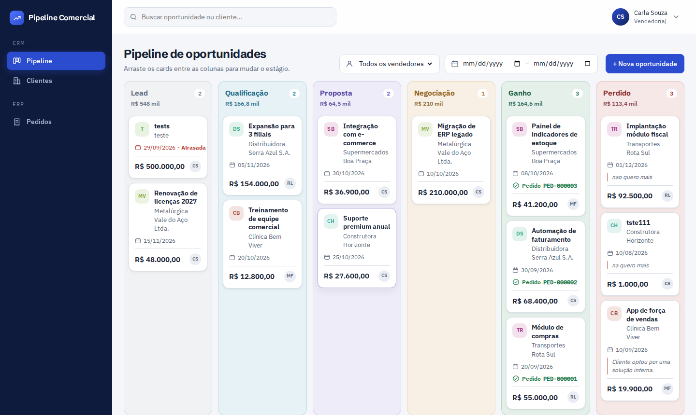
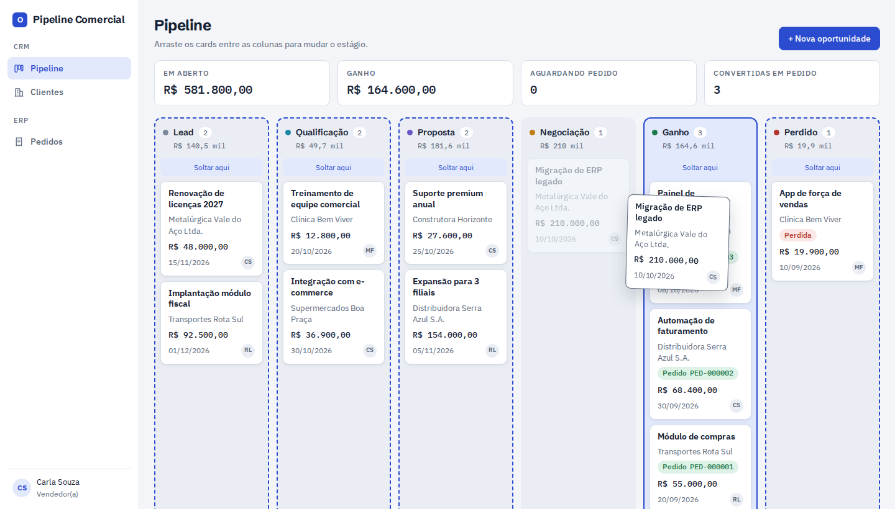
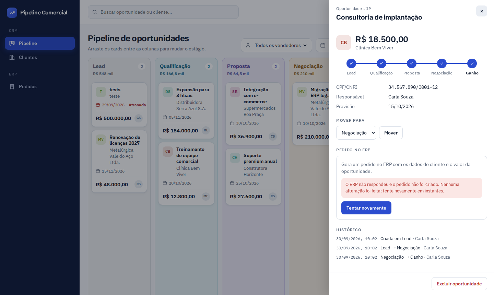
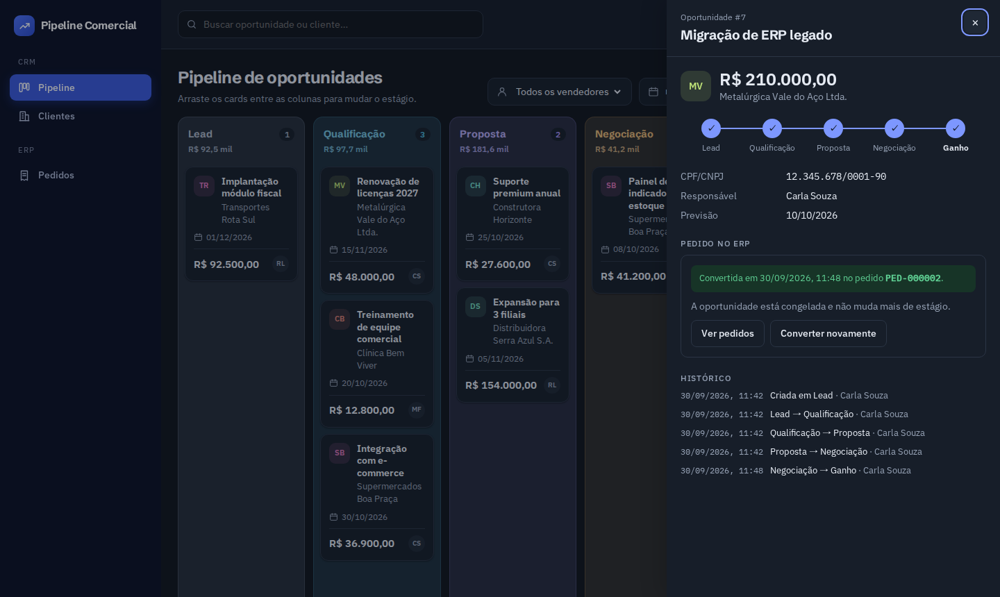
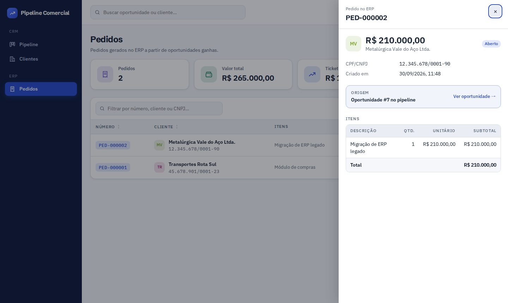

# Mini Pipeline Comercial com Integração ERP

Desafio técnico — **OZIO Tecnologia** · Desenvolvedor Full Stack Pleno

Aplicação onde vendedores gerenciam oportunidades comerciais em um quadro kanban e
convertem uma oportunidade ganha em um pedido no ERP.



| Arrastando: colunas permitidas destacadas | ERP fora do ar: erro tratado na tela |
| --- | --- |
|  |  |
| **Oportunidade convertida (tema escuro)** | **Pedidos gerados no ERP** |
|  |  |

---

## Estrutura do repositório

```
.
├── back/     API REST em Django + Django REST Framework + PostgreSQL
├── front/    Aplicação React com React Router (SSR)
└── docs/     Capturas de tela
```

Cada pasta tem seu próprio README com instruções de execução.

---

## Stack

| Camada    | Tecnologia                                  |
| --------- | ------------------------------------------- |
| Back-end  | Python, Django, Django REST Framework       |
| Banco     | PostgreSQL                                  |
| Front-end | React, React Router (server-side rendering) |
| Kanban    | dnd-kit (mouse, toque e teclado)            |
| API       | RESTful                                     |
| Ambiente  | Docker Compose (banco, API e front)         |

---

## Domínio

O sistema é dividido em dois contextos independentes dentro do back-end:

### CRM — pipeline comercial

| Entidade      | Descrição                                                      |
| ------------- | -------------------------------------------------------------- |
| `Customer`    | Cliente / empresa associada à oportunidade                      |
| `Opportunity` | Oportunidade comercial: título, cliente, valor, estágio, dono   |

Estágios do pipeline:

```
Lead → Qualificação → Proposta → Negociação → Ganho
                                            └→ Perdido
```

Regras de transição (código em `back/crm/stages.py`):

- Os estágios abertos (Lead, Qualificação, Proposta e Negociação) podem ir e voltar entre si.
- Ganho só é alcançado a partir de Negociação.
- Qualquer estágio aberto pode ir para Perdido, e uma oportunidade Perdida pode ser
  reaberta como Lead.
- Uma oportunidade Ganha pode voltar para Negociação enquanto não for convertida. Depois
  da conversão, ela fica congelada.

### ERP — pedidos

| Entidade    | Descrição                                          |
| ----------- | -------------------------------------------------- |
| `Order`     | Pedido gerado a partir de uma oportunidade ganha    |
| `OrderItem` | Itens do pedido                                     |

O ERP é tratado como um serviço à parte: o CRM se comunica com ele por uma interface
explícita, de forma que a origem dos pedidos possa ser trocada por um ERP real sem
alterar as regras do pipeline.

---

## Regra central: conversão em pedido

`POST /api/opportunities/{id}/convert/`

A conversão é o ponto crítico da aplicação e respeita as seguintes garantias:

- **Pré-condição** — somente oportunidades no estágio `Ganho` podem ser convertidas.
- **Idempotência** — converter a mesma oportunidade duas vezes não cria dois pedidos;
  a segunda chamada devolve o pedido já existente.
- **Atomicidade** — a criação do pedido e a marcação da oportunidade acontecem na mesma
  transação; qualquer falha no ERP desfaz a operação inteira.
- **Erro visível** — indisponibilidade do ERP retorna um erro tratado, exibido ao
  usuário no front-end.

Como cada garantia é implementada (`back/crm/services.py`, função `convert_opportunity`):

| Garantia       | Implementação                                                                 |
| -------------- | ----------------------------------------------------------------------------- |
| Pré-condição   | Fora de `Ganho` responde `409` com o código `opportunity_not_won`              |
| Idempotência   | Oportunidade já convertida devolve o pedido existente sem chamar o ERP (`200`); a chave `crm-opportunity:<id>` enviada ao ERP é única no banco, então nem uma repetição que chegue ao ERP cria outro pedido |
| Concorrência   | `select_for_update` na oportunidade: duas conversões simultâneas geram um único pedido |
| Atomicidade    | Pedido e marcação da oportunidade na mesma `transaction.atomic`               |
| Erro do ERP    | `503` com o código `erp_unavailable`; nada é gravado e a oportunidade continua em `Ganho`, pronta para nova tentativa |

Resposta de sucesso (`201` na primeira conversão, `200` nas seguintes):

```json
{ "order_number": "PED-000002", "created": true, "opportunity": { "...": "..." } }
```

Depois de convertida, a oportunidade fica congelada: não muda de estágio nem é editada
(`409`, código `opportunity_frozen`).

---

## API

| Método  | Rota                                | Descrição                          |
| ------- | ----------------------------------- | ---------------------------------- |
| `GET`   | `/api/opportunities/`               | Lista oportunidades do pipeline    |
| `POST`  | `/api/opportunities/`               | Cria uma oportunidade              |
| `GET`   | `/api/opportunities/{id}/`          | Detalha uma oportunidade           |
| `PATCH` | `/api/opportunities/{id}/`          | Atualiza uma oportunidade          |
| `DELETE`| `/api/opportunities/{id}/`          | Exclui (bloqueado se já convertida) |
| `PATCH` | `/api/opportunities/{id}/stage/`    | Move a oportunidade de estágio     |
| `POST`  | `/api/opportunities/{id}/convert/`  | Converte em pedido no ERP          |
| `GET`   | `/api/customers/`                   | Lista clientes com totais do pipeline |
| `POST`  | `/api/customers/`                   | Cadastra cliente (CPF/CNPJ com ou sem pontuação) |
| `GET`   | `/api/customers/{id}/`              | Detalha um cliente                 |
| `GET`   | `/api/orders/`                      | Lista pedidos gerados              |
| `GET`   | `/api/orders/{id}/`                 | Detalha um pedido com seus itens   |
| `GET`   | `/api/me/`                          | Usuário dono do token              |
| `GET`   | `/api/health/`                      | Verificação de saúde (pública)     |

Todas as rotas, exceto `/api/health/`, exigem o header `Authorization: Token <token>`.
Filtros da listagem de oportunidades: `?stage=`, `?customer=` e `?search=`. A listagem de
clientes aceita `?ordering=` com `name`, `document`, `open_count`, `won_count` ou
`open_amount` (prefixo `-` para decrescente).

Erros de regra de negócio seguem o formato do DRF, com um código estável para o front:

```json
{ "detail": "Só é possível marcar como Ganho a partir de Negociação.", "code": "invalid_stage_transition" }
```

| Código                     | HTTP | Quando                                             |
| -------------------------- | ---- | -------------------------------------------------- |
| `invalid_stage_transition` | 409  | Movimentação fora das regras do pipeline           |
| `opportunity_frozen`       | 409  | Oportunidade já convertida sendo alterada ou excluída |
| `lost_reason_required`     | 400  | Ida para Perdido sem motivo                        |
| `opportunity_not_won`      | 409  | Conversão de oportunidade fora de Ganho            |
| `erp_unavailable`          | 503  | ERP fora do ar durante a conversão                 |

### Autenticação sem tela de login

Esta versão não tem login: o foco do desafio é o pipeline e a conversão. A API continua
protegida por token, e o front-end (SSR) usa o token do vendedor padrão, criado pelo comando
`seed` a partir da variável `API_TOKEN`. O navegador nunca recebe o token, porque só o
servidor do React Router conversa com a API. Adicionar login depois não muda o back-end:
basta o front obter o token do usuário em vez de usar o fixo.

---

## Como executar

Pré-requisitos: Docker e Docker Compose, ou Python 3.12+ e Node 20+ com PostgreSQL local.

```bash
git clone <url-deste-repositorio>
cd desafio-ozio
docker compose up --build
```

A aplicação abre em **`http://localhost:3000`**. A API sobe em `http://localhost:8000/api/`
(verificação: `GET /api/health/`) e o admin em `http://localhost:8000/admin/`. Na subida, o
compose aplica as migrations e roda o `seed`, que cria vendedores, clientes e oportunidades
de exemplo. Para chamar a API direto:

```bash
curl -H "Authorization: Token dev-only-api-token" http://localhost:8000/api/opportunities/
```

Instruções detalhadas em [`back/README.md`](back/README.md) e [`front/README.md`](front/README.md).

### Roteiro para avaliar

1. **Arrastar e soltar:** leve "Renovação de licenças 2027" de Lead para Qualificação. O card
   muda na hora (atualização otimista) e a mudança fica registrada no histórico.
2. **Regra de transição:** tente levar um card de Proposta direto para Ganho. A coluna aparece
   como "Não permitido" e um aviso explica o motivo.
3. **Perdido:** solte um card em Perdido. Um modal pede o motivo da perda.
4. **Cadastro e exclusão:** use "+ Nova oportunidade". Ela entra como Lead. Se o cliente não
   existir, "Cadastrar novo cliente" abre o cadastro e volta com ele já selecionado (também
   dá para cadastrar pela tela Clientes). Para apagar um
   cadastro feito por engano, abra o card e use "Excluir oportunidade" (há confirmação).
   Oportunidades já convertidas em pedido não podem ser excluídas.
5. **Conversão:** mova "Migração de ERP legado" de Negociação para Ganho, clique no card e use
   "Converter em pedido". O pedido aparece em **Pedidos**, e "Converter novamente" devolve
   o mesmo número, sem duplicar.
6. **ERP fora do ar:** suba a API com a falha simulada e tente converter outra oportunidade
   ganha. A tela mostra o erro, nada é gravado e o botão vira "Tentar novamente".

   ```bash
   ERP_SIMULATE_FAILURE=True docker compose up -d api                   # bash
   $env:ERP_SIMULATE_FAILURE="True"; docker compose up -d api           # PowerShell
   ```

   Para voltar ao normal, repita o comando com `False`.

---

## Decisões técnicas

- **CRM e ERP sem chave estrangeira entre si.** O CRM guarda só o número do pedido, e o ERP
  guarda uma cópia dos dados do cliente. A única porta entre eles é `erp/services.py`
  (`ErpGateway`), então o ERP simulado pode virar um cliente HTTP de um ERP real sem mexer
  nas regras do pipeline.
- **Regras na camada de serviço.** Views só validam formato; `crm/services.py` aplica as regras
  e trava a linha da oportunidade (`select_for_update`) em toda alteração.
- **Idempotência em duas camadas.** A oportunidade convertida responde sem chamar o ERP, e a
  `idempotency_key` única no banco do ERP protege contra repetições que cheguem até ele.
- **Erros com código estável** (`{"detail", "code"}`), para o front decidir o que mostrar sem
  depender do texto da mensagem.
- **SSR com o token só no servidor.** O navegador fala apenas com o servidor do React Router,
  que chama a API. Assim o token não vaza e a primeira resposta já chega com o kanban pronto.
- **Atualização otimista derivada do estado do fetcher**, sem cópia local dos dados: se a API
  recusar a movimentação, o card volta sozinho para a coluna de origem.
- **Exclusão só para engano.** Negócio encerrado vai para Perdido e mantém o histórico;
  excluir apaga a oportunidade e é bloqueado depois da conversão, porque o pedido no ERP
  referencia o número dela.
- **Regras de transição espelhadas no front** (`front/app/lib/stages.ts`) só para orientar o
  arrastar; quem decide é sempre o back-end.

---

## Testes

```bash
docker compose exec api python manage.py test    # 71 testes do back-end
docker compose exec api ruff check .             # lint
docker compose exec web npm run typecheck        # tipos do front-end
```

Os testes do back-end cobrem transições de estágio, bloqueio da conversão fora de Ganho,
idempotência, rollback quando o ERP falha e duas conversões simultâneas da mesma oportunidade.
O front-end foi validado em navegador (Chromium) nos fluxos do roteiro acima, em desktop,
celular e tema escuro.

---

## Andamento

- [x] Estrutura do repositório e ambiente
- [x] Modelagem e migrations
- [x] API REST do CRM
- [x] Módulo ERP e criação de pedidos
- [x] Regra de conversão com idempotência
- [x] Front-end com SSR
- [x] Kanban com drag and drop
- [x] Conversão pela interface
- [x] Testes
- [x] Ajustes visuais e documentação final

---

Desenvolvido por **Adriana Messias**
