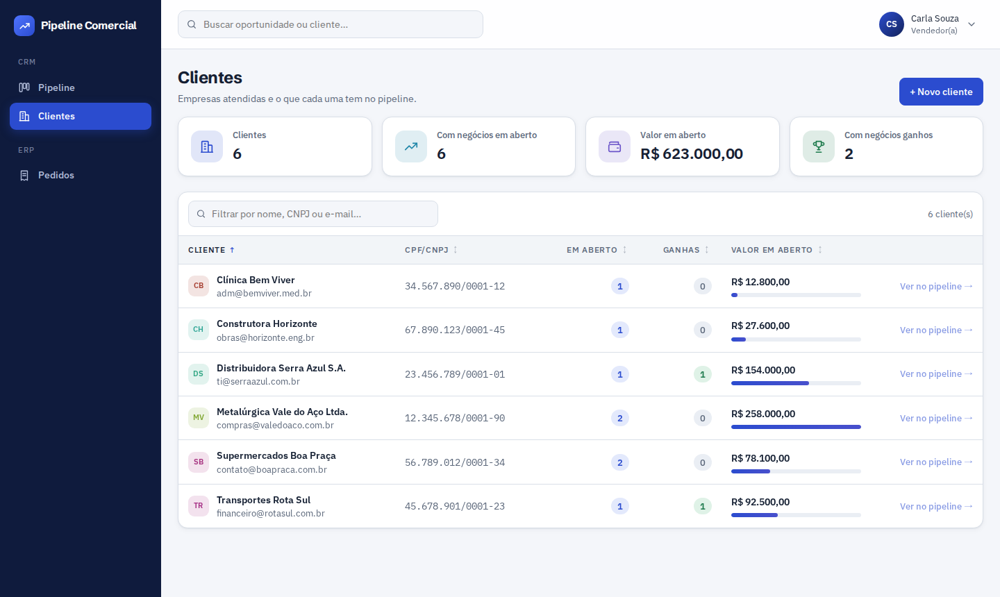
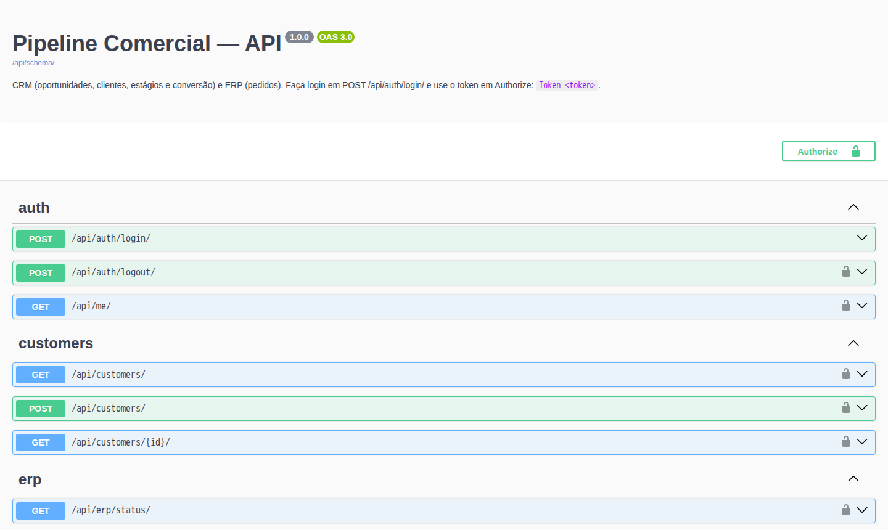
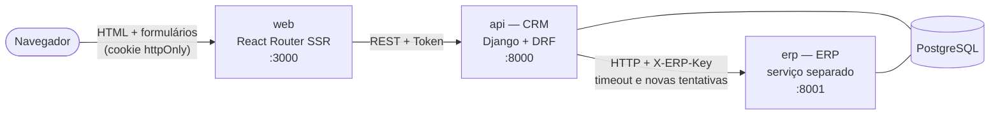
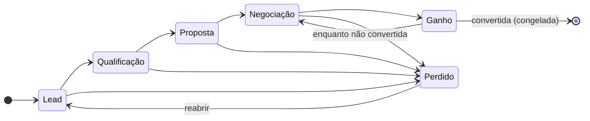
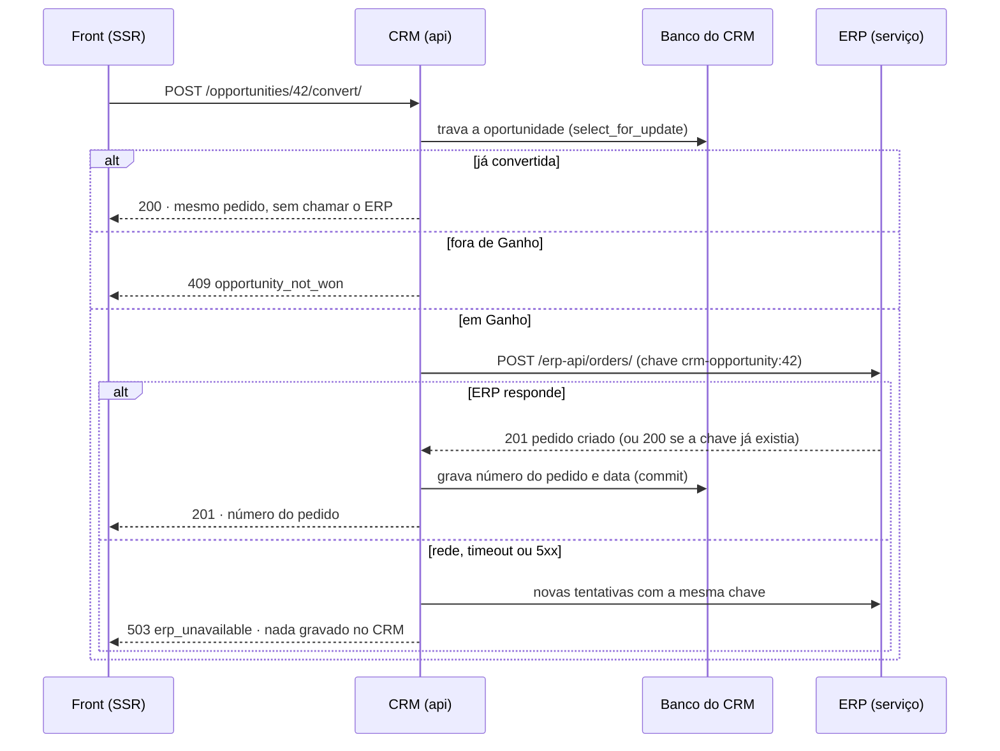

# Mini Pipeline Comercial com Integração ERP

[](https://github.com/Adrianamessias01/desafio-ozio/actions/workflows/ci.yml)

Desafio técnico — **OZIO Tecnologia** · Desenvolvedor Full Stack Pleno

Vendedores gerenciam oportunidades comerciais num kanban e transformam uma oportunidade
ganha em um pedido no ERP, que roda como um serviço separado e é chamado por HTTP.


| Arrastando: colunas permitidas destacadas | ERP fora do ar: erro tratado na tela |
| --- | --- |
|  |  |
| **Oportunidade convertida (tema escuro)** | **Pedido no ERP, com a oportunidade de origem** |
|  |  |
| **Clientes** | **Documentação da API (Swagger)** |
|  |  |

---

## Como executar

Pré-requisito: Docker com Docker Compose.

```bash
git clone https://github.com/Adrianamessias01/desafio-ozio.git
cd desafio-ozio
docker compose up --build
```

| O quê | Endereço |
| --- | --- |
| **Aplicação** | http://localhost:3000 |
| Documentação da API (Swagger) | http://localhost:8000/api/docs/ |
| API do CRM | http://localhost:8000/api/ |
| Serviço ERP | http://localhost:8001/erp-api/health/ (exige a chave `X-ERP-Key`) |

**Contas de demonstração:** `carla`, `rafael` ou `marina`, todas com a senha `ozio1234`.
Na subida, o compose aplica as migrations e roda o `seed`, que cria vendedores, clientes e
oportunidades de exemplo (uma delas já convertida em pedido).

### Roteiro para avaliar

1. **Login:** entre como `carla` / `ozio1234`. O menu no avatar tem a opção **Sair**.
2. **Arrastar e soltar:** leve "Renovação de licenças 2027" de Lead para Qualificação. O card
   muda na hora (atualização otimista) e a mudança fica no histórico da oportunidade.
3. **Regra de transição:** tente levar um card de Proposta direto para Ganho. A coluna aparece
   como "Não permitido" e um aviso explica o motivo. Em Perdido, um modal pede o motivo.
4. **Conversão:** mova "Migração de ERP legado" para Ganho, abra o card e use
   **Converter em pedido**. O pedido aparece em **Pedidos**; "Converter novamente" devolve o
   mesmo número. No pedido, o cartão **Origem** leva de volta à oportunidade.
5. **ERP fora do ar de verdade:** pare o serviço do ERP e tente converter outra oportunidade
   ganha. A faixa do kanban fica vermelha, a tela mostra o erro, nada é gravado e o botão
   vira "Tentar novamente". Religue o ERP e a mesma conversão funciona.

   ```bash
   docker compose stop erp     # derruba o ERP
   docker compose start erp    # volta ao normal
   ```

6. **Clientes:** filtre por nome ou CNPJ e use **Ver no pipeline** para abrir o kanban só
   com as oportunidades daquele cliente. Novos clientes podem ser cadastrados na tela
   Clientes ou direto do formulário de oportunidade.

---

## Arquitetura



- **web:** só o servidor do React Router conversa com a API. O token do vendedor fica num
  cookie `httpOnly` assinado; o JavaScript do navegador nunca o vê.
- **api (CRM):** pipeline, clientes, regras de estágio e conversão. Fala com o ERP apenas pela
  interface `ErpGateway` (`back/erp/services.py`).
- **erp:** serviço à parte, com API própria (`POST /erp-api/orders/`). Não conhece os modelos
  do CRM: recebe uma cópia dos dados do cliente e uma chave de idempotência. Pode simular
  latência e falha (`ERP_SIMULATE_LATENCY_MS`, `ERP_SIMULATE_FAILURE`).
- CRM e ERP compartilham o servidor PostgreSQL por simplicidade, mas em tabelas próprias e
  **sem chave estrangeira** entre os contextos. O ERP poderia ir para outro banco sem mudar
  o CRM.

| Pasta | Conteúdo |
| --- | --- |
| [`back/`](back/README.md) | Django + DRF: apps `crm`, `erp` e `core` |
| [`front/`](front/README.md) | React Router (SSR), kanban com dnd-kit |
| `e2e/` | Testes de navegador com Playwright |
| `docs/` | Capturas de tela e demonstração |

---

## Domínio

### CRM: pipeline comercial

| Entidade      | Descrição                                                    |
| ------------- | ------------------------------------------------------------ |
| `Customer`    | Cliente / empresa associada à oportunidade                   |
| `Opportunity` | Título, cliente, valor, estágio, vendedor, previsão, motivo da perda |
| `OpportunityStageChange` | Auditoria de cada mudança de estágio (de, para, quem, quando) |



- Os estágios abertos (Lead, Qualificação, Proposta, Negociação) vão e voltam entre si.
- **Ganho só a partir de Negociação.** Qualquer estágio aberto pode ir para Perdido, com motivo
  obrigatório; Perdido só reabre como Lead.
- Depois da conversão em pedido, a oportunidade fica **congelada**: não muda de estágio, não
  é editada nem excluída.

Regras em `back/crm/stages.py` e `back/crm/services.py`. O front espelha a tabela de
transições (`front/app/lib/stages.ts`) só para orientar o arrastar; quem decide é a API.

### ERP: pedidos

| Entidade    | Descrição                                               |
| ----------- | ------------------------------------------------------- |
| `Order`     | Número (`PED-000001`), cópia dos dados do cliente, total, situação e `idempotency_key` única |
| `OrderItem` | Itens do pedido                                          |

---

## Regra central: conversão em pedido

`POST /api/opportunities/{id}/convert/`



| Garantia | Como é garantida |
| --- | --- |
| **Pré-condição** | Fora de `Ganho` responde `409` (`opportunity_not_won`). |
| **Idempotência** | Oportunidade já convertida devolve o pedido existente sem chamar o ERP. A chave `crm-opportunity:<id>` é única no ERP: qualquer repetição que chegue até ele devolve o mesmo pedido. |
| **Concorrência** | `select_for_update` na oportunidade: duas conversões simultâneas geram um único pedido (testado com duas threads). |
| **Atomicidade** | No CRM, a marcação da oportunidade só é gravada, na mesma transação da trava, depois que o ERP confirma o pedido. Se o ERP falha, nada muda no CRM. Se o ERP criou o pedido mas a resposta se perdeu, a próxima tentativa recebe o mesmo pedido pela chave e o vincula, sem duplicar. No ERP, pedido e itens são gravados juntos. |
| **Erro visível** | ERP fora do ar, lento ou com erro 5xx: novas tentativas com espera crescente; esgotadas, `503` (`erp_unavailable`) com mensagem clara e botão "Tentar novamente" na tela. Recusa do ERP (4xx) vira `502` (`erp_rejected`), sem repetir. |

---

## API

A documentação completa e interativa está no **Swagger: http://localhost:8000/api/docs/**
(faça login em `POST /api/auth/login/` e use o token em **Authorize** como `Token <token>`).

| Método | Rota | Descrição |
| --- | --- | --- |
| `POST` | `/api/auth/login/` | Troca usuário e senha por um token (limite de 10 tentativas/min por IP) |
| `POST` | `/api/auth/logout/` | Revoga o token |
| `GET` `POST` | `/api/opportunities/` | Lista (filtros `stage`, `customer`, `owner`, `search`, `close_from`, `close_to`) e cria |
| `GET` `PATCH` `DELETE` | `/api/opportunities/{id}/` | Detalha, edita e exclui (bloqueado se convertida) |
| `PATCH` | `/api/opportunities/{id}/stage/` | Move de estágio, com as regras de transição |
| `POST` | `/api/opportunities/{id}/convert/` | Converte em pedido no ERP |
| `GET` `POST` | `/api/customers/` | Lista com totais do pipeline (`ordering`) e cadastra |
| `GET` | `/api/orders/`, `/api/orders/{id}/` | Pedidos com itens (`ordering`) |
| `GET` | `/api/sellers/`, `/api/erp/status/`, `/api/me/`, `/api/health/` | Vendedores, status do ERP, usuário logado e saúde |

Erros de regra de negócio têm um código estável, para o front decidir o que mostrar sem
depender do texto:

```json
{ "detail": "Só é possível marcar como Ganho a partir de Negociação.", "code": "invalid_stage_transition" }
```

| Código | HTTP | Quando |
| --- | --- | --- |
| `invalid_stage_transition` | 409 | Movimentação fora das regras do pipeline |
| `opportunity_frozen` | 409 | Oportunidade já convertida sendo alterada ou excluída |
| `lost_reason_required` | 400 | Ida para Perdido sem motivo |
| `opportunity_not_won` | 409 | Conversão de oportunidade fora de Ganho |
| `erp_unavailable` | 503 | ERP fora do ar, lento ou com erro interno |
| `erp_rejected` | 502 | ERP recusou o pedido |
| `invalid_credentials` | 400 | Login com usuário ou senha incorretos |

---

## Testes e qualidade

Tudo roda no [CI](.github/workflows/ci.yml) a cada push.

| Onde | O que cobre | Comando |
| --- | --- | --- |
| Back-end (101 testes) | Transições, congelamento, conversão (pré-condição, idempotência, rollback, **duas conversões simultâneas**), API do ERP, cliente HTTP (tentativas, timeout, 4xx/5xx) e **ida e volta HTTP real** entre CRM e ERP, login e limite de tentativas | `docker compose exec api python manage.py test` |
| Front-end (15 testes) | Regras de transição espelhadas, atraso, formatação pt-BR, origem do pedido | `docker compose exec web npm test` |
| Navegador (9 testes) | Login e Sair; arrastar permitido, bloqueado e para Perdido; conversão idempotente com o pedido apontando a origem; clientes | `docker compose --profile e2e run --rm e2e` |
| Estático | Lint (ruff), tipos (tsc), migrations em dia, esquema OpenAPI válido | ver o CI |

O teste de navegador de conversão cria um pedido de verdade; rode-o num banco de teste
(no CI o banco é criado do zero).

---

## Decisões técnicas

- **ERP como serviço separado, por HTTP.** O CRM só conhece o contrato `ErpGateway`. Em
  produção a implementação é o cliente HTTP (`HttpErpGateway`); nos testes do CRM, a lógica
  local, rápida e isolada. Trocar por um ERP real é escrever outra implementação do contrato.
- **Idempotência como base da resiliência.** Como o pedido é identificado pela chave da
  oportunidade, repetir a chamada é sempre seguro. Isso permite novas tentativas automáticas
  e resolve o caso em que o ERP criou o pedido mas a resposta não chegou.
- **Regras na camada de serviço** (`crm/services.py`). Views só validam formato; toda
  alteração trava a linha da oportunidade.
- **SSR com o token só no servidor**, em cookie `httpOnly`. A primeira resposta já chega com
  o kanban montado, e o token não vaza para o navegador.
- **Atualização otimista derivada do estado do fetcher**, sem cópia local dos dados: se a API
  recusar a movimentação, o card volta sozinho para a coluna de origem.
- **Filtros e ordenação na URL** (`?owner=`, `?customer=`, `?sort=`…): recarregar ou
  compartilhar o link mantém a visão.
- **Exclusão só para cadastro feito por engano.** Negócio encerrado vai para Perdido e mantém
  o histórico; depois da conversão, excluir é bloqueado.

## O que eu faria com mais tempo

- **Conversão assíncrona com outbox:** gravar a intenção de pedido na transação do CRM e
  enviar ao ERP por uma fila com reprocessamento, em vez de esperar o ERP dentro da
  requisição.
- **Itens na conversão:** hoje o pedido sai com um item (a própria oportunidade); o ideal é
  escolher produtos, quantidades e descontos.
- **Permissões por papel:** vendedor vê e edita só as próprias oportunidades; gestor vê tudo.
- **Paginação e busca no servidor** para listas grandes, e atualização em tempo real do kanban
  entre usuários (WebSocket ou SSE).
- **Observabilidade:** logs estruturados com id de requisição de ponta a ponta (front → CRM →
  ERP) e métricas de latência e falha do ERP.
- **Deploy** com o estágio de produção dos Dockerfiles (gunicorn e `react-router-serve`) e
  banco gerenciado.

---

## Stack

| Camada | Tecnologia |
| --- | --- |
| Back-end | Python 3.12, Django 5.2, Django REST Framework, drf-spectacular |
| Banco | PostgreSQL 16 |
| Front-end | React 19, React Router 8 (SSR), TypeScript, dnd-kit |
| Testes | Django TestCase, Vitest, Playwright |
| Ambiente | Docker Compose e GitHub Actions |

---

Desenvolvido por **Adriana Messias**
